# PaypalAPI

# ¿Qué es Paypal?
PayPal es una empresa estadounidense que opera en casi todo el mundo un
sistema de pagos en línea que soporta transferencias de dinero entre usuarios y
sirve como una alternativa electrónica a los métodos de pago tradicionales
como cheques y giros postales.

# ¿Para qué sirve Paypal?
PayPal crea formas de administrar y transferir dinero, y ofrece opciones y
flexibilidad al enviar pagos, pagar o recibir pagos.

# Documentación
https://developer.paypal.com/

Aquí se puede encontrar la documentación de PayPal, en esta página se pueden encontrar varios apartados como Revisa, plataforma de comercio de PayPal, suscripciones, pagos, facturación, aceptar pagos con tarjeta.
En revisa se puede encontrar los botones exclusivos de PayPal para el uso comercial. En este apartado se brinda el script para el uso del mismo y le muestra al usuario como utilizarlo.
En plataforma de comercio de PayPal le muestra al usuario los pasos que el maneja mediante el uso de API REST y productos personalizados elaborados por PayPal como son los botones. En este también le brinda algunos beneficios que obtendrá al usar la plataforma de PayPal.
En suscripciones informa que con las suscripciones de PayPal puede generar facturas a los clientes o a servicios. 
Muestra características de integración y los API que este utiliza, también muestra acerca de planes de precios y cómo funciona una integración de suscripciones mediante unos flujos tanto si compra una cuenta de PayPal o sin una cuenta.
En pagos muestra el que se necesita saber para realizar los pagos. De igual manera muestra un flujo en el cual se realiza el pago en PayPal.
En facturación enseña lo que ofrece mediante las facturas, las opciones de integración, el cómo funciona mediante un diagrama y el ciclo de vida de la factura junto con las dos tipos de factura que existe.

# Requisitos
Todas las solicitudes al API de PayPal requieren credenciales para
verificar que el llamado de datos sea hecho a través de una cuenta valida
de PayPal. Los llamados de datos solían requerir estar asociados por
medio de los credenciales a una cuenta de negocios
Todas las funciones del API REST de PayPal están disponibles en una
cuenta “sanbox” gratuita. Para habilitar transacciones con características
en vivo se debe ingresar información adicional y adquirir una cuenta de
negocios.
¿Que necesitas para obtener una cuenta de desarrollador?
Una cuenta ordinaria. PayPal ha dejado de separar la cuenta de sandbox
de su cuenta de desarrollador, por ende, para utilizar los servicios del API
solo necesitas una cuenta en PayPal debidamente verificada.
Con la cuenta ya creada en PayPal te darán un código de credenciales.
Este código de credencial lo puedes utilizar para utilizar los muchos
servicios que PayPal ofrece.

# ¿Cómo usar el API de Paypal?

1. Entrar a este link https://developer.paypal.com/developer/accounts/ 
2. Darle al botón que dice Log in to Dashboard 
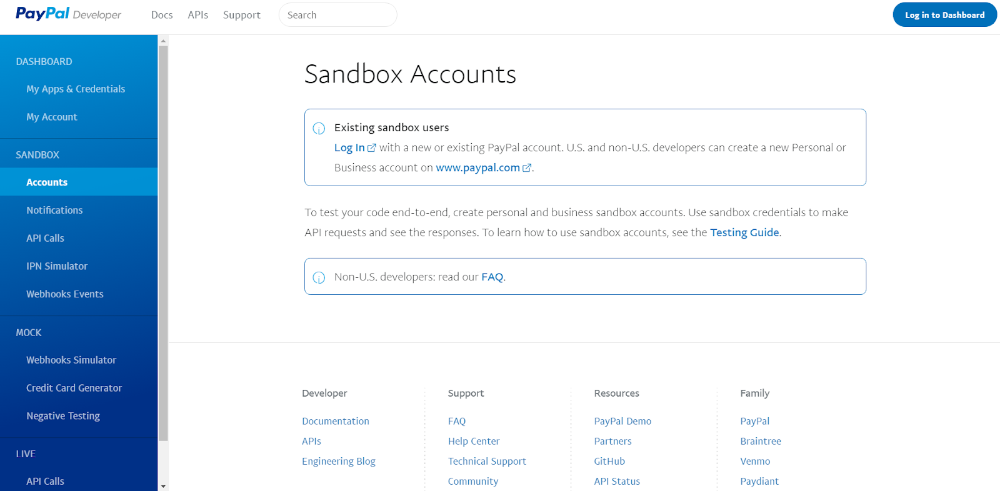 
3. Se inicia sesión o se crea una nueva cuenta de Paypal. 
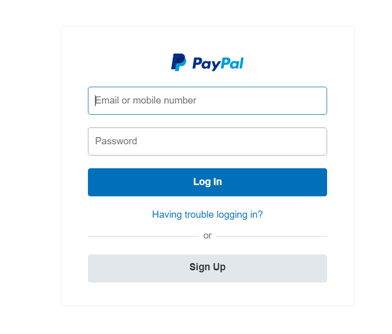 
4. En el menú selecciona la opción que dice Accounts. Ahí podrá ver las cuentas que están asociadas a su cuenta, todas son cuentas de prueba, por defecto Paypal le crea a uno 2 cuentas una de business que una cuenta persona que se usa para hacerse pasar por una empresa y la otra cuenta es para comprar productos la cual ya te tiene dinero y una tarjeta “falsa” que está asociada a la cuenta para hacer pruebas de compra. 
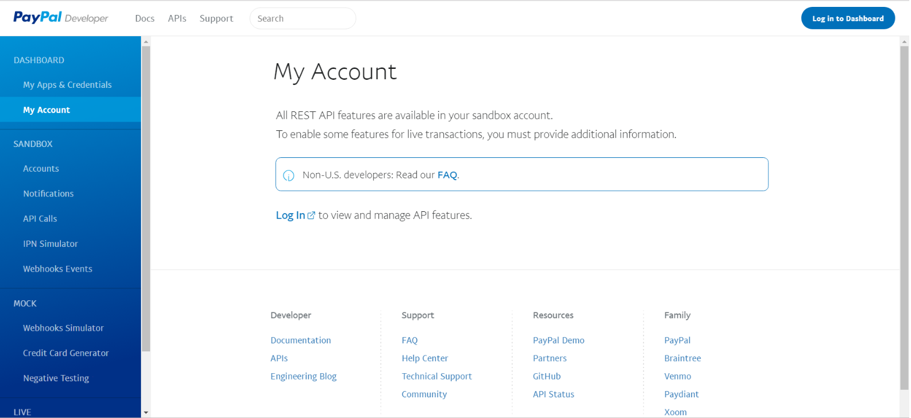 
5. Al lado de cada cuenta hay un botón que dice Actions el cual hay que darle click y entrará a la configuración de esta cuenta, a esas dos que se crean por defecto hay que darles una contraseña para poder usarlas, luego de ponerle una contraseña a una cuenta esta se activará y podrá ser usada de prueba.  
6. Luego entre a este link https://www.sandbox.paypal.com/cr/home  
7. Seleccione el botón de iniciar sesión que se encuentra en la parte de ariba e ingrese con la cuenta que desee, por ejemplo inicie sesión con la cuenta de Business. 
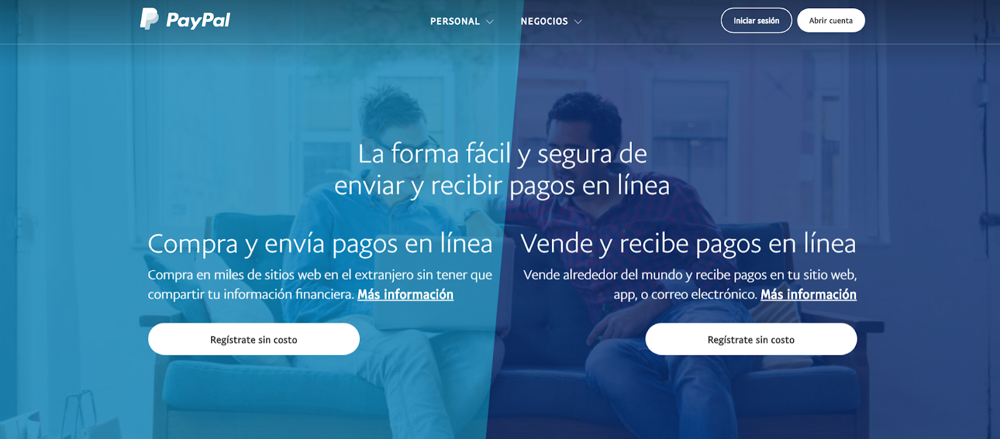 
8. Aquí podrá ver todo lo que tiene que ver con su cuenta business, entre al menú donde dice Tools y seleccione la opción de All Tools. 
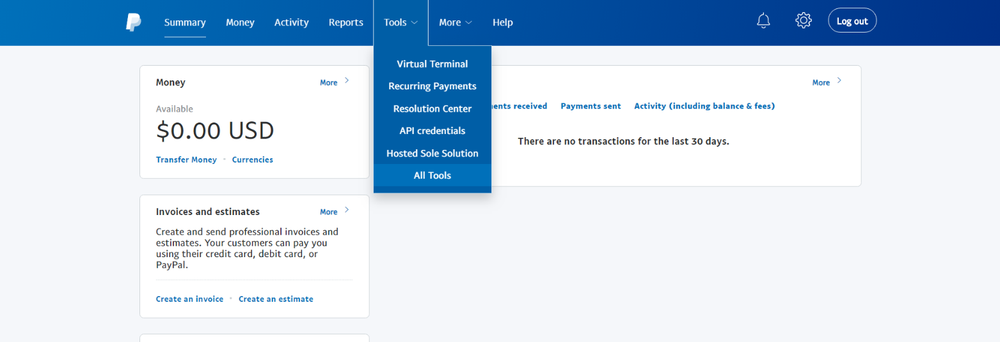 
9. Aquí están todas las herramientas que se pueden hacer con la cuenta Business, en el ejemplo que haremos será con los botones, entonces buscamos la herramienta que diga Paypal buttons. 
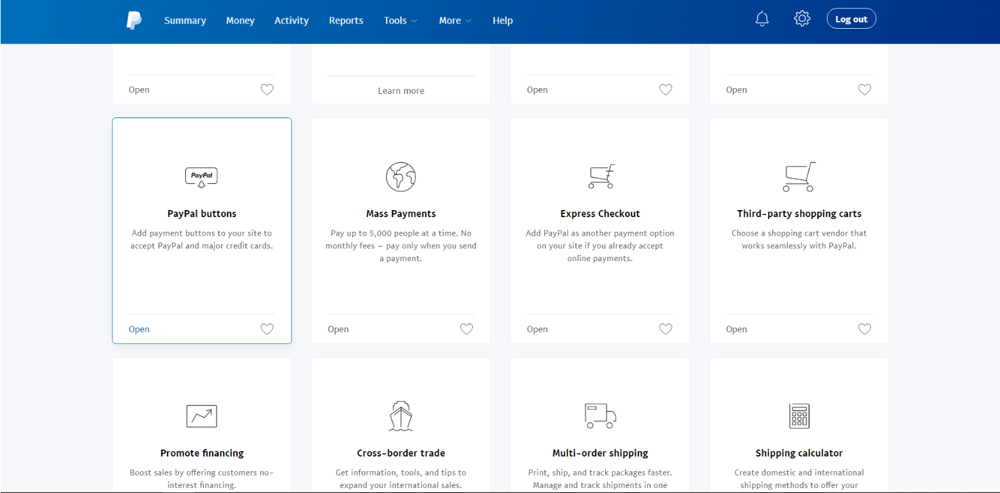 
10. Aquí van a aparecer todos los tipos de botones que existen, para el código que hay de ejemplo se usan dos botones, uno de carrito y otro para compra un solo producto, aquí haremos la prueba de carrito, vamos donde dice Action en el botón de añadir a carrito y luego la opción de crear un nuevo botón. 
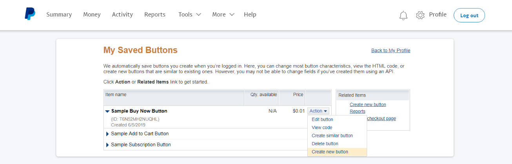 
11. Aparecerán varias opciones para modificar el botón como queramos, llenaremos los datos indicados con el producto que deseamos agregar. 
 
12 Buscaremos el botón que dice crear botón y Paypal automáticamente nos creará el código html del botón el cual solamente se tendrá que copiar y pegar dentro del html que deseamos que tenga esta funcionalidad. 
 
13. En nuestra página html nos creará el botón.
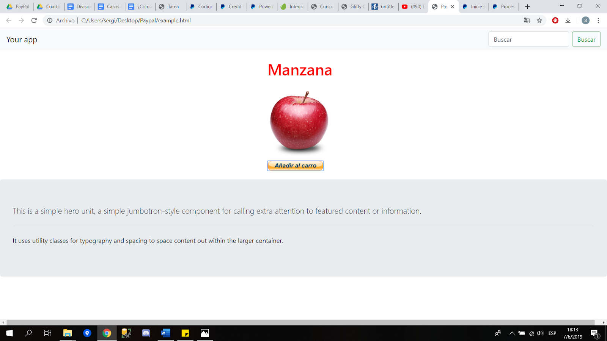 
14. Al darle click automáticamente nos enviará al carrito de compras y nos saldrá el producto que seleccionamos con toda la información correspondiente. 
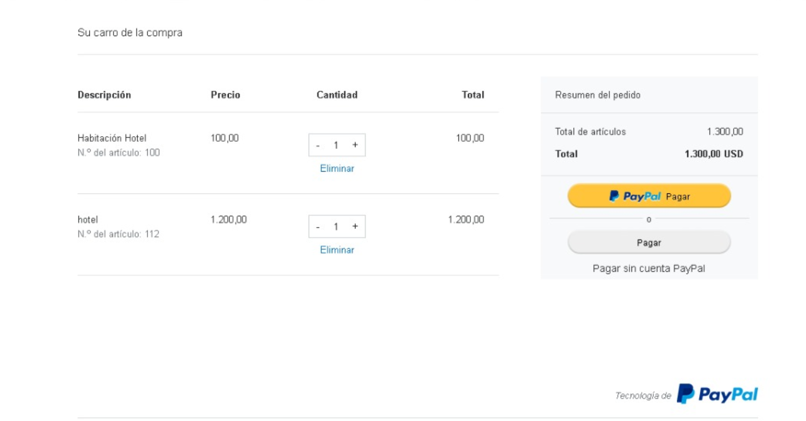 
15. Para comprar el articulo nos dejará iniciar sesión en Paypal o comprar el producto sin tener que registrarse en Paypal, para iniciar sesión en Paypal y probar la compra es recomendable usar la cuenta personal que dice "buyer" ya que esta cuenta con una tarjeta asociada de prueba. 
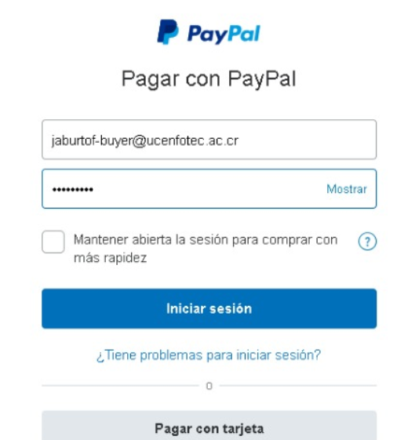 
16. Luego de iniciar sesión seleccionaremos la cuenta de paypal ya que al ser una cuenta sandbox ahí tendremos todo el dinero de prueba y la selecionamos. 
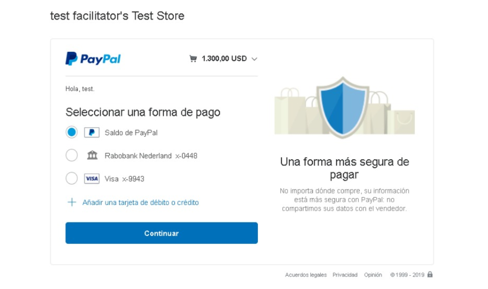 
17. Nos mostrará la información del método de pago que seleccionamos y procederemos al pago. 
 
18. Por último nos muestra la factura con todo el pago realizado. 
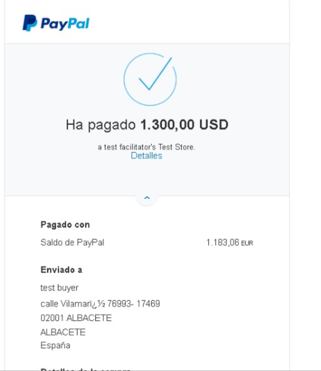 

## Nugets  
1. Newtonsoft.Json  
2. Paypal  

## Youtube
https://www.youtube.com/watch?v=LKXJDetxnnQ&t=127s
